# MonitorMe

1.  [**Welcome**](#welcome)
	 - [**About Team**](#about-team)
	 - [**Members**](#members)
	 - [**Reference Links**](#reference-links)
2.  [**Requirement**](#requirements)
     - [**Functional Requirements**](#functional-requirements)
     - [**Non Functional Requirements**](#non-functional-requirements)
	 - [**Assumptions**](#assumptions)
3.  [**Proposed Architecture**](#proposed-architecture)
	 - [**Characteristics**](#characteristics)
4.  [**Functional Viewpoint**](#functional-viewpoint)
5.  [**System Component**](#system-component)
6.  [**System Context**](#system-context)
7.  [**Software Architect**](#software-architect)
8.  [**Data flow/Information Flow Diagram**](#data-flowinformation-flow-diagram)
9.  [**System Architecture**](#system-architecture)
10. [**Operational Viewpoint**](#operational-viewpoint)
11. [**Deployment Viewpoint**](#deployment-viewpoint)
12. [**Architecture Decision Records(ADR)**](#architecture-decision-recordsadr)

## Welcome

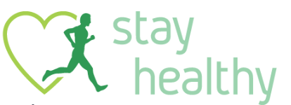

### About Team
We are **Team ByteBusters**, a bunch of creative minds passionate about making hospitals friendlier and safer for patients. Imagine being in a hospital with a magical dashboard that continuously monitors patient well-being. That's what we're aiming to build.

Our team is a blend of architects, software engineers, computer whizzes, and healthcare tech enthusiasts. We've joined forces to create something special: a dashboard for hospitals that tracks patient vital signs—heart rate, blood pressure, oxygen levels, blood sugar, ECG, body temperature, and sleep status.

This dashboard is designed to reduce nurses' workloads and ensure patient privacy. It doesn't just display patient vitals; if any sign starts fluctuating, our MonitorMe software springs into action, sending alerts/notifications to doctors and medical professionals.

We are deeply committed to the privacy and security of patient information. Rest assured, patients' vital secrets are safe with the hospital. We've implemented authentication methods for our dashboard to ensure that only authorized personnel can access this information.

Team ByteBusters is all about devising solutions to make hospitals smarter, safer, and more caring. Stick around, and you'll see our proposed solution for this magical dashboard.

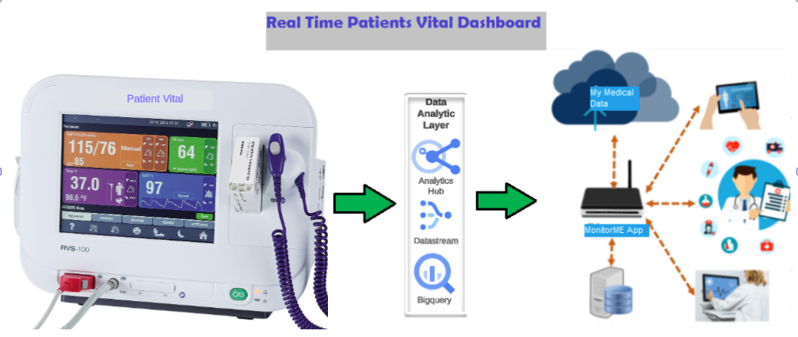

### Members
- Prakash Ganesan https://www.linkedin.com/in/prakash-ganesan-662337111/
- Vivek Sharma https://www.linkedin.com/in/sharma-vivek
- Kishan Gandikota Krishna Kumar https://www.linkedin.com/in/gkkishan/
- Supriya Arora https://www.linkedin.com/in/supriya-arora-18a76215/
- Sweetali Bankar https://www.linkedin.com/in/sweetali-bankar-a7940859/

### Reference Links:
- [Apache Flink / Apache Spark, A details comparison for data processing](https://dev.to/mage_ai/apache-flink-vs-apache-spark-a-detailed-comparison-for-data-processing-36d3)
- [Flutter for Desktop and native mobile app development](https://docs.flutter.dev/get-started/flutter-for/react-native-devs)
- [Comparison InfluxDB vs. Prometheus vs. TimescaleDB](https://db-engines.com/en/system/InfluxDB%3BPrometheus%3BTimescaleDB)
- [Flutter vs. React Native vs. Ionic](https://medium.com/@nautilustechlabs/ionic-vs-react-native-vs-flutter-whats-best-for-2023-a8ae061d5542)

## Requirements

For the original requirements please follow [here](./Requirements/OriginalRequirements.md)

## Functional Requirements
- **Real-Time Data Capture**: Capture vital signs data in real-time from various monitoring devices.

- **Data Analysis and Alert Generation**: Analyze captured data to identify trends, detect anomalies, and generate alerts for abnormal readings.

- **Alert Notification**: Send immediate notifications to medical professionals through the UI and mobile app upon anomaly detection.

- **Historical Data Access**: Allow access and review of historical vital signs data for up to 24 hours by medical professionals.

- **Patient Data Snapshot Upload**: Facilitate the upload of patient snapshots to the MyMedicalData system for record-keeping.

- **Data Collection and Transmission**: It collects data from the vital signs machine and transmits it to the nursing station's consolidated monitoring screen.

- **Data Recording and Storage**: Store the time series data in a database for analytic queries by the medical staff.

- **Analyze each patient’s vital signs in real-time**: The ability to analyze patient data in real-time, compare it to given threshold limits, and send notifications to the nurse station and mobile devices.

- **Deployment**: Deployment of MonitorMe system should consider in on-premises environment.

- **Confidentiality**: Patient data should be secure.

## Non-functional Requirements

- **Performance**: Ensure processing and display of vital signs data within 1 second for real-time monitoring efficiency.

- **Fault Tolerance**: If any of vital sign device (or software) fails, MonitorMe must still function for other vital sign monitoring. (Monitor, record, analyze, and alert).

- **Scalability**: 
	- Support data from up to 500 patients per installation, with capabilities to scale up as needed. 
	- MonitorMe should be configurable dashboard to integrate with other vital monitoring devices.

- **Deployability**: Design for easy deployment and updates within a hospital's IT infrastructure, accommodating on-premises and potential cloud deployments.

- **Reliability**: Achieve an uptime of 99.9%, with failover mechanisms to maintain critical functionality.

- **Security**: Implement data encryption in transit and at rest, with strict access controls to protect patient confidentiality.

- **Usability**: Provide an intuitive UI for medical professionals, enabling quick access to vital information and easy alert management.

- **Data Integrity**: Vital sign data analyzed and recorded must be as accurate as possible. After all, human lives are at stake. 

- **Adaptability**: - Monitor me is a new line of business for StayHealthy, this new app should be able to adapt new changes to meet the market demands.
 

## Assumptions

- Hospital should have facility if any faulty patient monitoring device, then capture patients vital manually or replace machine.
- For Disaster recovery, hospital should consider to have availability of servers in separate locations and technical team keep doing every 6 month DR activity.
- Regular security assessments, penetration testing, and compliance audits are conducted to ensure adherence to industry standards and regulations.

## Proposed Architecture
Identified key architectural characteristics during requirements analysis as mentioned below. 
Additional details are covered here: [System Components Overview](./Requirements/SystemComponentsOverview.md)

### **Characteristics**

| Top     | Characteristics       | Details                                                                                            |
| ------- | ------------------- | -------------------------------------------------------------------------------------------        |
|  X      | Performance         | The MonitorMe app should perform efficiently to deliver real-time patient vital data.   |
|  X      | Fault Tolerance     | This is critical. Even if any of the vital sign devices fail, MonitorMe must continue to function for other vital monitoring tasks, including monitoring, recording, analyzing, and issuing alerts.|
|  X      | Scalability         | MonitorMe should have the capability to scale in the future to accommodate an increased patient load.|
|         | Deploybility        | Deployment should consider an on-premises environment.|
|         | Configurability     | MonitorMe's vital sign machine or rule engine should be configurable.|
|         | Data Integrity      | Data should be secure, and transmitting data from one environment to another should be encrypted|
|         | Adaptability        | The MonitorMe app should possess the flexibility to easily incorporate new devices, rules, or other elements as required.|

The team chose an <u>event-driven architecture</u> as the best fit, in line with the main characteristics identified. 

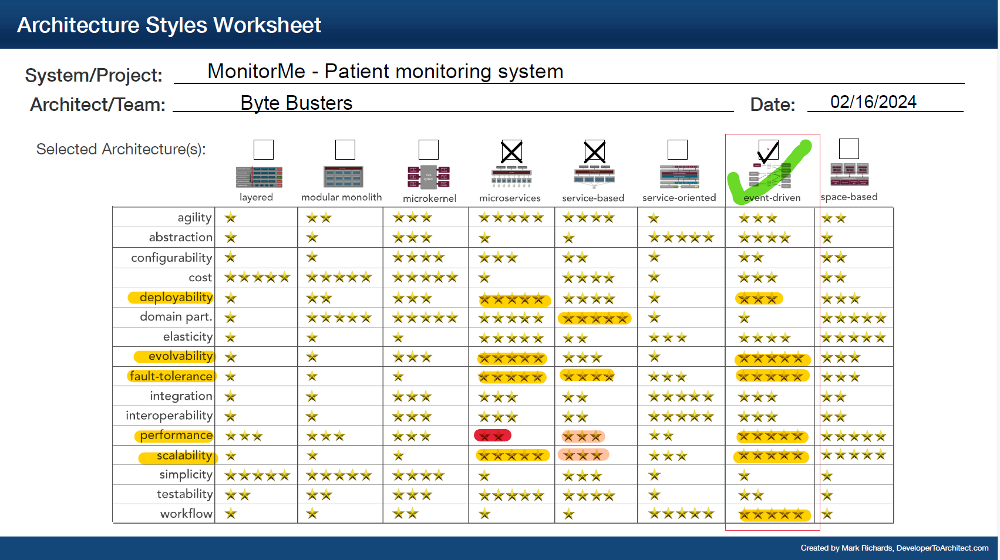

## Functional Viewpoint

According to the functional requirements we discerned, we have pinpointed our primary workflow. Although we possess numerous other workflows, they are all interconnected with this principal flow.

### Main Flow

The primary operation involves obtaining patient's vital data from the **monitoring devices**. This data is subsequently processed and diverted to three distinct locations. The first portion of real-time data is routed to the **Consolidated Screen**, which simultaneously acts as the **nurse station**. Here, continuous monitoring of the patient's vitals is carried out by nursing personnel. Secondly, the system screens for any threshold alerts. In case any are detected, notifications are triggered to the StayHealthy mobile app and displayed on the **Consolidated Screen** at the nurse station. The final component of the operation involves data storage in a database for **time series data**.

**Medical professionals** have the ability to query this time series data from the **Data Analytical** screen. They are also provided with the facility to upload snapshots of the patient's condition for review. 

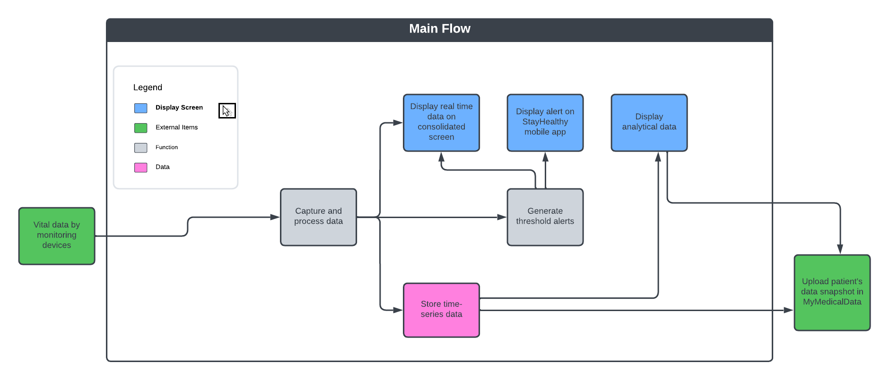

## System Component

### 1. Data Ingestion Layer
- **Responsibilities**: Collects data from various vital sign monitoring devices, ensuring accurate and timely data capture.
- **Key Focus**: Performance, Reliability, Scalability
- **Design Consideration**: Utilizes high-throughput message brokers for handling diverse data streams efficiently. Implements fault tolerance and is scalable to accommodate data volume fluctuations.

### 2. Data Processing and Analytics Engine
- **Responsibilities**: Processes and analyzes incoming data in real-time to identify trends, detect anomalies, and generate alerts.
- **Key Focus**: Performance, Concurrency, Elasticity
- **Design Consideration**: Employs parallel data processing and scalable resources to ensure prompt analysis and alerting. Adapts dynamically to processing demands for optimal performance.

### 3. Notification System
- **Responsibilities**: Generates and dispatches alerts to medical professionals via various channels, ensuring prompt and reliable notifications.
- **Key Focus**: Reliability, Performance, Security
- **Design Consideration**: Guarantees delivery of critical alerts with a secure and efficient mechanism, respecting data privacy and ensuring reliability.

### 4. Consolidated Monitoring Screen UI
- **Responsibilities**: Displays real-time and historical vital signs data, providing a user-friendly interface for clinical staff.
- **Key Focus**: Performance, Deployability, Usability
- **Design Consideration**: Optimized for rapid data refresh and ease of use. Supports straightforward deployment and updates across hospital systems.

### 5. StayHealthy Mobile App
- **Responsibilities**: Receives alerts and displays patient data snapshots, facilitating mobile access for doctors and physicians.
- **Key Focus**: Security, Performance, Reliability
- **Design Consideration**: Ensures secure data transmission and authentication, optimized for efficient operation and reliable alert delivery on mobile devices.

### 6. MyMedicalData Integration Interface
- **Responsibilities**: Securely uploads patient snapshots to MyMedicalData, ensuring seamless integration and data consistency.
- **Key Focus**: Security, Scalability, Reliability
- **Design Consideration**: Uses secure API protocols for data transfer, designed to handle high volumes of data integrations reliably and efficiently.

For more details refer 
- [System Componencts Overview document](./Requirements/SystemComponentsOverview.md)
- [System Componenct Details](./Requirements/SystemComponentDetails.md)
- [Notification Design Document](./Requirements/NotificationDesign.md)

## System Context

A System Context Diagram is a high-level graphical representation, showcasing the interaction of a software application with its external entities such as users, external devices, data, and so on.

See below all the integration points

* Nurse
* Consolidated Monitoring Screen
* Medical Professionals
* Analytical Data Screen
* StayHealthy Mobile App
* Time Series Data
* MyMedicalData
* Data Injection Pipleline 
* Notification Publisher
* Patient Monitoring Equipments
* Snapshot Component
* Real Time Stream Processor
* Data Analyzer / Rule Engine

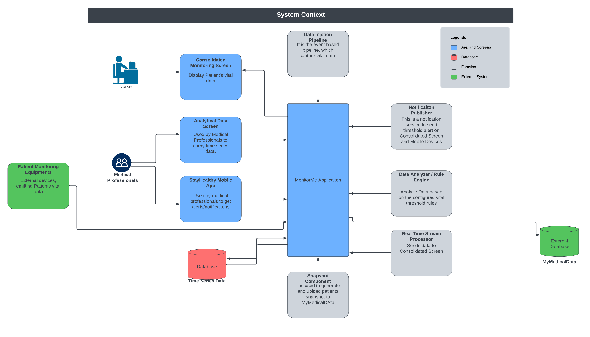

## Software Architect

* 1st Layer is Presentation Layer which will have a login screen for authentication and registration for Nurses & Medical staff. This feature allows users to register and identify their medical credentials and securely store their information in the application servers.

* 2nd Layer is Business Layer which exposes the business logic implemented in the Business logic to potential consumers. We divided this layer into three blocks, in which the Healthcare Subsystem is used to check the data generated from the patient. The other block called Management Subsystem which has an administrative function, tasked with supervising and managing multiple patients, wearable devices and healthcare workers and last layer integrates with microservices one example is uploading patient snapshot to MyMedical Data

* 3rd Layer is Data Access Layer which contains components to abstract the logic required to access the data stores. Such components provide common data access functionality, isolating the upper layers from the specific database technology, and making the application easier to maintain and configure.

* 4th Layer is Persistence Layer which provides several advantages to the software since it is more efficient to save and retrieve data and provide for the whole application. In our context, we have four data sources, namely: Patient vital tracking Devices, patient data, Health Data,  Logging Data and Timeseries DB

One advantage of the proposed  application in the solution framework is the interaction with the end users. Using the platform, Medical healthcare workers can track multiple patients health conditions in a centralized and reliable manner. Note that the proposed real-time monitoring platform can be integrated into vital tracking devices. It is essential to highlight that a distributed system such as this proposed MonitorMe application needs a fully distributed security system.

## Data flow/Information Flow Diagram

Based on functional requirements we identified data flow **MonitorMe** application should support. The data flow for our application begins with integrating Data Ingesion Pipeline with Patient Monitoring Equipments to capture the patient's vital information.

* **Data Ingestion Pipeline**: Collects data from various vital sign monitoring devices via automated feeds, ensuring accurate and timely data capture, process/transform the data and publish to multiple downstream systems in real time.

* **RealTime stream processor**: Stream the real time data on the monitoring screen at Nursing stations

* **Data Analyzer/Rule Engine**: Analyze the vitals based on configured threshold and alert will be sent to Notification publisher in case of anomaly.

* **Notification publisher**: Push Notification to registered Medical Professionals on StayHealth Mobile device as well as on the consolidated monitoring screeen. 

* **Data Storage**: Time series data will be stored for further analysis by the Medical Professionals.

* **Snapshot Component**: APIs will be exposed to download the Patient's vitals snapshot and can be uploaded to MyMedicalData using secure HTTP API call.

* **Data API**: This will be used to query analytical data by the Medical Professional to analyze patient's vitals.

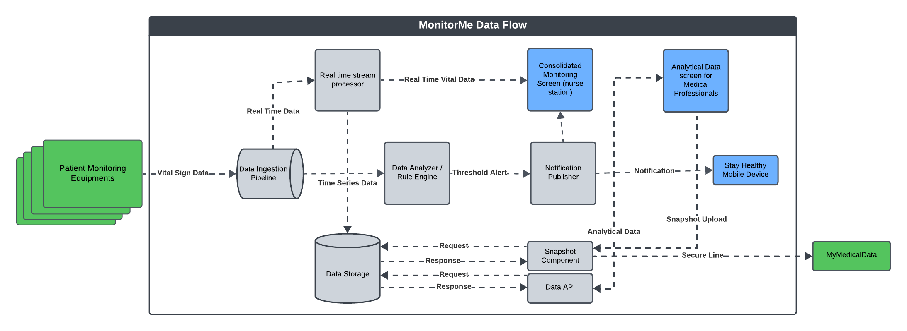

### System Architecture

The diagram represents the workflow of a medical software system designed to monitor and manage patient vital signs in real-time. MonitorMe is responsible for sending real-time updates regarding patients' vital signs to a centralized monitoring screen. 

* Data Transmitter process the collected vital signs data and transmit to Kafka stream (a distributed event streaming platform that handles real-time data feeds) 

* Kafka Stream send the data to Realtime stream processor (Flink) 

* Realtime stream processor send the feed to Monitoring Screen. This process involves the use of a "VitalSign API" and a "VitalSign App" that collectively  
  facilitate the querying and receiving of vital signs data, which is then rotated and displayed on the monitoring interface, also adjust the display as per requirement to display 20 patients every 5 seconds.

* Realtime stream processor also stores vital sign to Timeseries database which is used by Data Analyzer as well as Snapshot Processor

* Data Analyzer
	Rule Engine: A critical component that aids in adjusting alerts based on specific parameters, ensuring that the system remains adaptive and responsive to varying patient conditions.
	
* Stream Analytics: Analyze the patients' vitals against the rules from Rule engine and Sent notification to Notification Publisher to notify the Mecical staff.

* Alert Config APIs: To update the alert configuration

* Notification Publisher push the notification to Medical professional devices like Stay Healthy Mobile App.

* Snapshot processor: Medical professionals can request snapshots of vital signs data and sync to MyMedicalData via Secure HTTP Gateway API

Overall, the diagram meticulously outlines the interconnected components and processes of a sophisticated software flow dedicated to real-time monitoring, analysis, and management of patient vital signs, emphasizing its utility in enhancing healthcare delivery and patient monitoring practices.

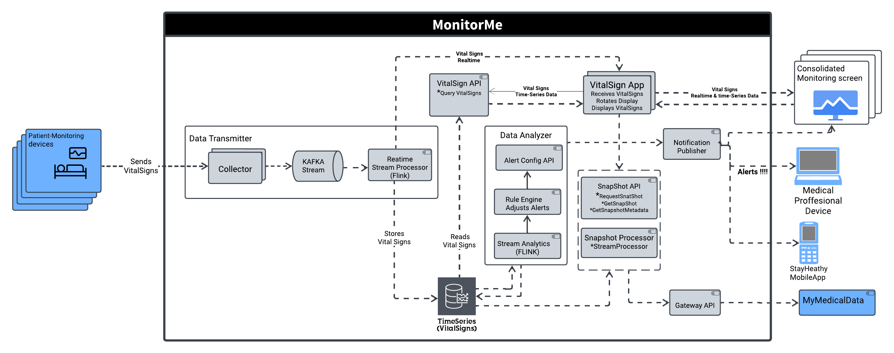

## Operational ViewPoint
Describes how the system will be operated when it is running in the hospital facility. 

* **Nurse Station**: Here nurse need to login to app with Monitoring Interface role to access and monitor patient's vital data. This is the monitoring interface where nurses observe a patient's vital data. The screen displays one patient's data at a time, automatically transitioning to the next patient every five seconds. If a patient's threshold alert is activated, an alert will appear at the top of the screen. These alerts will persist and require nurse acknowledgment before they can be dismissed. If alerts are activated for multiple patients, they will appear sequentially, one following the other.

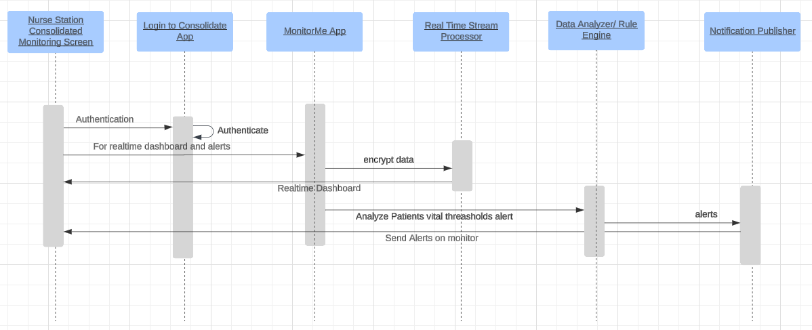	

* **Analytical Screen**: This interface is intended for medical professionals who have been granted access privileges to the Analytic Screen. These professionals can solicit time series data within a specific date/time range. The interface also allows them to request patient snapshots for uploading onto the MyMedicalData platform.

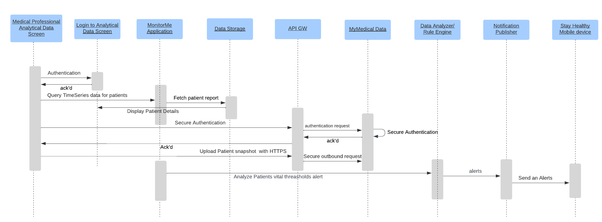

* **StayHealthy Mobile App**:  Medical professionals can also download and install the StayHealthy mobile app, provided they have the appropriate role permissions. This will enable them to receive threshold alerts.

## Deployment Viewpoint

Deploying a real-time dashboard for monitoring hospital patient vitals on-premises requires consideration of various factors to ensure reliability and security. To ease the deployment process all the components will be packaged together that can be easily deployed using straightforward instructions.

**Hardware Infrastructure**: Ensure that the hardware meets performance and scalability needs, considering factors such as CPU, memory, storage, and network bandwidth.

**Security and Compliance**: 
* User authentication SSO/LDAP strategies should be enforced along with Role-Based Access Control (RBAC) to limit access to confidential data.
* Apply current firewall policies/rules to safeguard patient data. This should be done in conjunction with implementing TLS/SSL protocol for encrypted data transmission. 
* Data encryption, access controls, and audit trails are implemented to protect sensitive patient information.

**High Availability and Disaster Recovery**: MonitorMe app will be configured with high availability and disaster recovery mechanisms to ensure continuous availability of the real-time dashboard in case of hardware failures or natural disasters. Following factors will be considered to minimize downtime and data loss such as
* Data replication
* Load balancing
* Failover clustering

**Deployment Environment**: We preferred to use Kubernetes as orchestration tool to manage containerized applications to ensure scalability and fault tolerance.

**Monitoring and Alerting**:
* Continuous monitoring of system health, performance metrics, and data quality is crucial.
* Prometheus and Grafana will be used for monitoring and alerting.
* Alerts will be configured to notify system administrators in case of system failures, performance degradation, or data discrepancies.

**Testing and Validation**: 
* Comprehensive testing and verification of the real-time dashboard application to ensure its reliability, accuracy, and performance under various conditions.
* Execute load testing, security testing, and user acceptance testing (UAT) to detect and rectify any concerns if there is any.

We can effectively deploy a real-time dashboard for monitoring hospital patient vitals on-premises, providing healthcare professionals with timely insights to improve patient care and outcomes while maintaining data security and regulatory compliance.

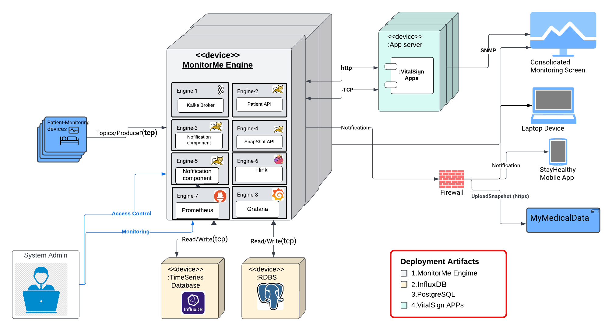

## Technology Stack
Below is the technology diagram which we prefer to develop MonitorMe app.
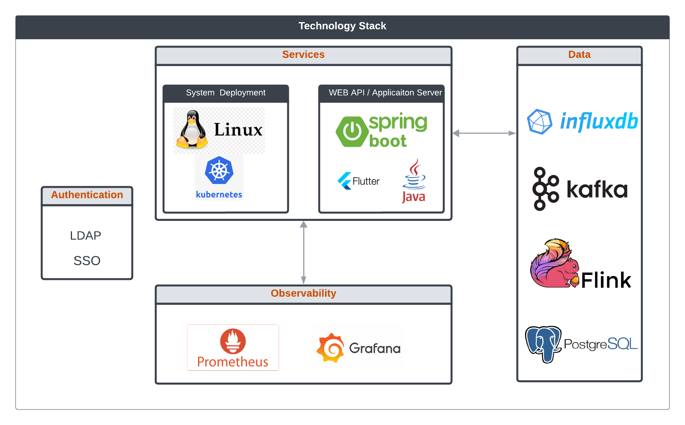

## Security Perspective
As specified in the requirements, given that this is an  on-premises application installation, we have minimal security concerns. However, there are a few security implementations we must establish, as detailed below.

* **Secure Snapshot Upload**: Establish a secure connection for uploading snapshot data to MyMedicalData using secure http connection.
* **Role Based Security**: We are required to implement role-based security measures to differentiate between medical professionals using the Consolidated Screen, Analytical Screen, and mobile devices.

## Architecture Decision Records(ADR)

### [ADR 1](ADRs/ADR1.md) Use Apache Kafka for Data Ingestion
### [ADR 2](ADRs/ADR2.md) Implement Apache Flink for Real-Time Data Processing
### [ADR 3](ADRs/ADR3.md) Adoption of Flutter for Mobile App Development
### [ADR 4](ADRs/ADR4.md) Selecting InfluxDB for Time-Series Data Storage
### [ADR 5](ADRs/ADR5.md) Utilizing React for Consolidated Monitoring Screen UI

