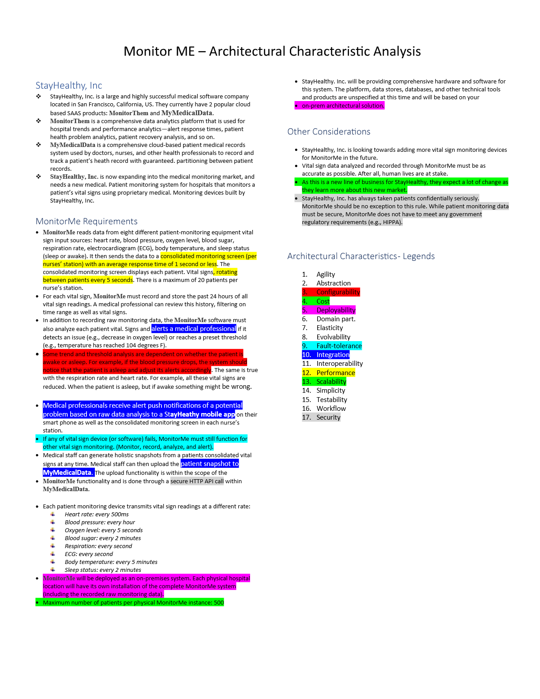

# MonitorMe System Requirements

This document outlines the functional requirements and system characteristics (non-functional requirements) for the MonitorMe system, providing a comprehensive overview of what the system is expected to achieve and how it should perform.

## Functional Requirements

Functional requirements describe the specific behaviors or functionalities of the system.

1. **Real-Time Data Capture**: Capture vital signs data in real-time from various monitoring devices.
2. **Data Analysis and Alert Generation**: Analyze captured data to identify trends, detect anomalies, and generate alerts for abnormal readings.
3. **Alert Notification**: Send immediate notifications to medical professionals through the UI and mobile app upon anomaly detection.
4. **Historical Data Access**: Allow access and review of historical vital signs data for up to 24 hours by medical professionals.
5. **Patient Data Snapshot Upload**: Facilitate the upload of patient snapshots to the MyMedicalData system for record-keeping.

## System Characteristics (Non-Functional Requirements)

System characteristics define the operational qualities of the system, focusing on performance, reliability, and other quality attributes.

1. **Performance**: Ensure processing and display of vital signs data within 1 second for real-time monitoring efficiency.
2. **Reliability**: Achieve an uptime of 99.9%, with failover mechanisms to maintain critical functionality.
3. **Security**: Implement data encryption in transit and at rest, with strict access controls to protect patient confidentiality.
4. **Scalability**: Support data from up to 500 patients per installation, with capabilities to scale up as needed.
5. **Deployability**: Design for easy deployment and updates within a hospital's IT infrastructure, accommodating on-premises and potential cloud deployments.
6. **Usability**: Provide an intuitive UI for medical professionals, enabling quick access to vital information and easy alert management.

These requirements ensure a clear understanding of the MonitorMe system's intended capabilities and performance standards, guiding the development and assessment process towards meeting user needs and operational goals.

